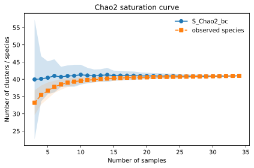
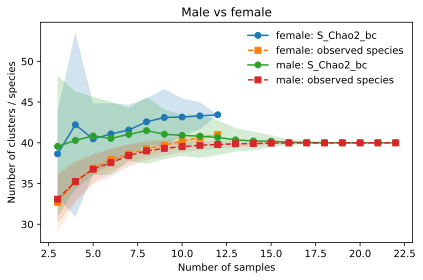

# AtlasCompleteness
This project integrates single-cell RNA sequencing (scRNA-seq) data with statistical biodiversity estimation methods to quantify cellular diversity within organs and assess the completeness of large-scale sequencing efforts. In Miihkinen et al. (under review Nat comms, bioRxiv: https://doi.org/10.1101/2025.01.08.631769), we show that the Chao2 statistical estimator can be used to quantify the completeness of large-scale single-cell sequencing projects.
## Chao2 Saturation Wrapper
In this repository, we provide a wrapper function for estimating atlas completeness using Chao2 statistics. The function generates richness saturation curves that illustrate how increasing sampling depth contributes to the discovery of new cell populations and how observed richness relates to Chao2-based estimates of total diversity across sampling depths. This tutorial shows examples of the wrapper function using colon immune atlas from James et al., Immunity (2023) DOI: 10.1016/j.immuni.2023.01.002. The atlas appears complete according to Chao2 estimates.



However, males and females are known to exhibit differences in immune system composition and function. Separating the immune atlas into subsets based on donor sex alters the saturation dynamics. The female donor subset appears less saturated than the male donor subset, suggesting that additional female samples may uncover previously unobserved cell populations:



Location:

```text
chao2_wrapper/
```

Main script:

```text
chao2_wrapper/chao2_saturation.py
```

Documentation gives instructions how to run the chao2 saturation scripts:

```text
chao2_wrapper/README.md
```

Example import:

```python
from chao2_wrapper.chao2_saturation import chao2_saturation_wrapper
```
